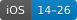
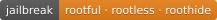
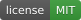

<p align="center"><b>English</b> · <a href="README.zh-CN.md">简体中文</a></p>

<p align="center"></p>

<h1 align="center">SFSymbolReplacer</h1>

<p align="center">Replace system SF Symbols with your own PNGs, system-wide.</p>

<p align="center">
  
  
  <a href="LICENSE"></a>
</p>

## Usage

The pane is in Settings under **SF 图标替换**, in Chinese or English (switch under Language).

- Open **All Symbols**, pick a symbol and import a PNG from Photos or Files. A transparent background works best.
- **Batch Import** takes several files at once and matches each file name to a symbol: `heart.fill.png` or `heart.fill@3x.png`. Names that don't match are listed and skipped.
- Under **Export**, **Save** on the Original row exports the system symbol as a PNG.
- By default a replacement is tinted like the system icon. Turn on **Keep Colors** to keep the PNG's own colors.
- **Restore Original** or **Restore All** puts the system icons back. Icons already on screen update when redrawn; respring to apply everywhere.

The detail page shows the symbol at its system size, e.g. 45×61 px. Save exports the same canvas at about 512 px on the long side (e.g. 377×511), so it stays sharp when drawn large. Replacements are rescaled to whatever size the system is drawing.

## How it works

The dylib is loaded through the `com.apple.CoreUI` filter.

It hooks the raster and image getters of `CUINamedVectorGlyph` (and `_CUIGraphicVariantVectorGlyph` on 16+), `+[UIImage systemImageNamed:]` with its variants, and `imageNamed:configuration:` on the CoreGlyphs `_UIAssetManager`. Only symbols from CoreGlyphs and SFSymbols.framework are replaced. App catalogs and custom symbols are left alone.

All placement goes through one function, `sf_compose` in `SFPlace.c`. The whole PNG is scaled to fit the raster the system is drawing (the symbol canvas), in the canvas proportions, and centered. A gap of less than 1 px is filled. On the UIKit side only the pixel content of the system image is swapped via `_imageWithContent:`, at the same pixel size, so size, alignment insets and baseline stay the system's.

<details>
<summary>Hooked selectors</summary>

CoreUI, on `CUINamedVectorGlyph` and `_CUIGraphicVariantVectorGlyph`:

- `rasterizeImageUsingScaleFactor:forTargetSize:` plus the `withColorResolver:`, `withHierarchyColorResolver:`, `withPaletteColors:`, `withPaletteColorResolver:`, `hierarchicalPrimaryColor:` and `withTintColors:` variants
- `rasterizeImageWithTintColor:usingScaleFactor:forTargetSize:`
- `image`, `imageWithColorResolver:`, `imageWithHierarchyColorResolver:`, `imageWithPaletteColors:`, `imageWithPaletteColorResolver:`, `imageWithHierarchicalPrimaryColor:`, `imageTintedWithColor:`, `imageTintedWithColors:`, `imageWithTintColor:`

UIKit:

- `systemImageNamed:`, `…withConfiguration:`, `…compatibleWithTraitCollection:`, `…variableValue:withConfiguration:` and the `_` / `__` private variants
- `-[_UIAssetManager imageNamed:configuration:]`

The set differs per version: 14 has `…withTintColors:` and `imageTintedWithColor(s):`, 15 adds hierarchy and palette, 16 adds palette resolvers, hierarchical primary color and the variant class, 26 adds the tint-color pair.

</details>

## Known limits

- SwiftUI / RenderBox symbols drawn as live vector paths stay stock. Most of the iOS 18 Control Center is drawn this way.
- Multicolor symbols get a single color unless Keep Colors is on.
- iOS 26 glass and material effects may post-process the bitmap.
- A PNG with a different aspect ratio than the symbol canvas is fitted with empty bands.
- The original is exported at regular weight; other weights have slightly different canvases.

## Storage

```
jbroot:/var/mobile/Library/SFSymbolReplacer/
  Replacements.plist        symbol name -> file
  Replacements/<name>.png   "/" in the name becomes "_"
  Options.plist             per-symbol options (KeepColors)
```

Imports are stored once as an upright PNG, without resizing or trimming. Decoding is capped at 2048 px. Changes are broadcast with the Darwin notification `com.iosdump.sfsymbolreplacer/Reload`.

## Building

Roothide Theos with the iOS 14.5 SDK (`TARGET = iphone:clang:14.5:14.0`):

```sh
make package FINALPACKAGE=1
make package FINALPACKAGE=1 THEOS_PACKAGE_SCHEME=rootless
make package FINALPACKAGE=1 THEOS_PACKAGE_SCHEME=roothide
```

Sources: `SFHooks.m` (hooks), `SFStore.c` (store used by the dylib), `SFPlace.c` (placement, shared with the pane), `SFSymbolStore.m` (store used by the pane), `sfsymbolreplacerprefs/` (settings pane).

## License

[MIT](LICENSE)

## Links

- Telegram: <https://t.me/iosdumpzzz>
- X: <https://x.com/apsnkizv>
